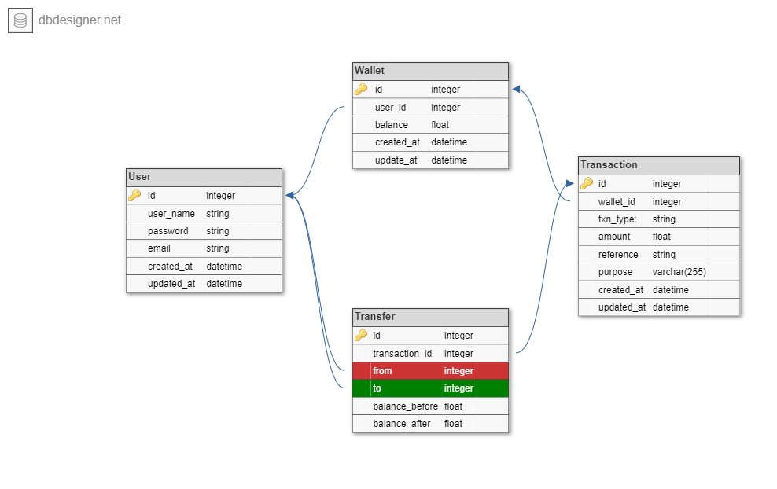

# Demo Credit SERVER API
Demo Credit Server API is a [nestjs](https://nestjs.com) projects that is built wit tje following technologies 
* NodeJS (LTS version)
* KnexJS ORM
* MySQL database
* Typescript (optional)

## Description

Demo Credit is a mobile lending app that requires wallet functionality. This is needed as borrowers need a wallet to receive the loans they have been granted and also send the money for repayments.

This demo project is developed as one of the requirement in landsqr nodejs role.

the task is based on the following MVP features:
* A user can create an account
* A user can fund their account
* A user can transfer funds to another user’s account
* A user can withdraw funds from their account.

## Database E-R Diagram


## Installation

```bash
$ npm install
```

## Running the app

```bash
# development
$ npm run start

# watch mode
$ npm run start:dev

# production mode
$ npm run start:prod
```
## Running migrations
in order to create all the nedeed database tables, you need to run following knex migration commands

```bash
# latest migration
$ npm run migrate:latest

# or 
# migration up
$ npm run migrate:up

# drop tables
$ npm run migrate:up
```
you can also run migrations for each migration files as

```bash
# migrate table
$ knex migrate:up <file name>

# drop table
$ knex migrate:down <file name>

```
you can also create a new migration file by running

```bash
# create migration
$ knex create migrate <file name>
```
you can visit [knex.js migration](https://knexjs.org/guide/migrations.html) page to learn all the commands you can perform

## Test

```bash
# unit tests
$ npm run test

# e2e tests
$ npm run test:e2e

# test coverage
$ npm run test:cov
```
## API documentation testing public url

**development**
http://localhost:4000/api

**production**
http://onesmus-okonkw-lendsqr-be-test/api


## Stay in touch

- Author - [Onesmus Okonkwo]


## License

Nest is [MIT licensed](LICENSE).
